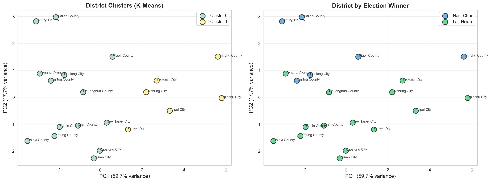
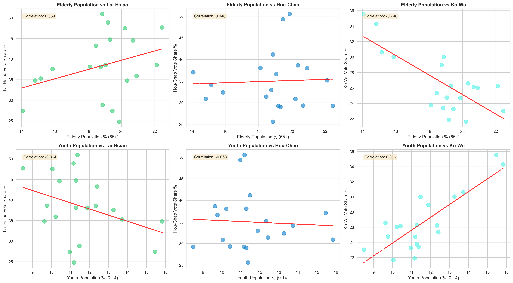

# Taiwan 2024 Presidential Election: Socioeconomic Analysis


---

## Project Approach

**This is an interpretability-focused study, not a predictive modeling project.**

Given the constraint of district-level data (N=20), this analysis prioritizes:
- Understanding feature-voting relationships (SHAP analysis)
- Identifying actionable district typologies (K-means clustering)
- Extracting policy-relevant insights for campaign strategies

## Project Overview

This project investigates how demographic, economic, and educational characteristics of Taiwan's 20 districts correlate with voting behavior in the 2024 presidential election. Rather than focusing solely on prediction accuracy, this study emphasizes **exploratory analysis**, **feature interpretation**, and **district typology** through advanced machine learning techniques.

### Project Problem Statement
1. How do socioeconomic factors correlate with voting patterns?
2. Can districts be grouped into meaningful clusters based on their characteristics?
3. Which features most influence voting behavior?
4. What insights can we derive about Taiwan's electoral landscape?

---

### Data Sources
Collected from goverment's opensources

- Central Election Commission (CEC): https://db.cec.gov.tw/
- Ministry of Interior Statistics: https://www.moi.gov.tw/cp.aspx?n=5590
- Directorate-General of Budget, Accounting and Statistics: https://www.dgbas.gov.tw/
- Ministry of Labor: https://statfy.mol.gov.tw/map02.aspx?cid=9&xFunc=68&xKey=1


## Methodology

- Logistic Regression, Random Forest, XGBoost → evaluate predictive power
- SHAP → interpret feature influence on voting
- K-Means clustering → identify district typologies

**Results & Model Performance**
Due to small sample size (20 districts), predictive accuracy is limited, main insights come from correlations and cluster analysis.

The primary value lies in:
- Identifying socioeconomic-voting correlations
- Understanding district typologies
- Interpreting feature importance

## Key Findings

**Socioeconomic factors such as age, household size, and education are the strongest predictors of district-level voting pattern**

### 1. Socioeconomic-Voting Correlations

| Category       | Feature / Metric         |           Effect on Voting / Insight                |
|----------------|--------------------------|-----------------------------------------------------|
| Age Structure  | Youth population (0-14%) | Higher youth → weaker Lai-Hsiao support             |
| Age Structure  | Elderly population (65+) | Higher elderly → stronger Lai-Hsiao support         |
| Household      | Avg people per household | Larger households → decreases Lai-Hsiao probability |
| Income         | Avg district income      | Higher income → more diverse voting patterns        |
| Education      | % Higher education       | Complex relationship with voting                    |


### 2. District Typology (Clustering Analysis)

| Cluster | Description                      | Avg Income | Education | Voting Lai-Hsiao | Districts    |
|---------|----------------------------------|------------|-----------|----------------- |------------- |
| 0       | Aging Middle-Income Moderate-Edu | 1.14M TWD  | 43%       | 64%              | 14 districts |
| 1       | Young High-Income High-Edu       | 1.65M TWD  | 56.7%     | 83%              |  6 districts |


### 3. Feature Importance (SHAP Analysis)

| Variable          | Feature                       | SHAP Value | Directionality                    |
| ----------------- | ----------------------------- | -----------| --------------------------------- |
| Avg_People_Per_HH | Household size                | 0.0648     | Higher → decreases Lai-Hsiao prob |
| Age_0_14_Pct      | Youth population percentage   | 0.0320     | Higher → decreases Lai-Hsiao prob |
| Age_65_Plus_Pct   | Elderly population percentage | 0.0314     | Higher → increases Lai-Hsiao prob |

### 4. Cluster Validation

  - Silhouette Score: 0.363 
  - Visual inspection (PCA): Clean separation along PC1 (59.72% variance)
  - Domain validation: Clusters align with known Taiwan urban-rural divide
  
### Limitations

**Why Prediction is Limited:**
- N = 20 (too small for reliable ML predictions)
- Class imbalance (Lai-Hsiao won 70% of districts)
- Complex political factors not captured (party identification, cross-strait stance, candidate charisma)
- High heterogeneity across districts
  
---

## Project Structure

```
Taiwan_election_prediction/
│
├── data/
│   ├── vote.csv                      # Election results
│   ├── population_structure_Jan.csv  # Demographics
│   ├── revenue.csv                   # Economic indicators
│   ├── education.csv                 # Education levels
│   └── processed/
│       └── cleaned_data.csv          # Integrated dataset
│
├── notebooks/
│   ├── 01_EDA.ipynb                  # Exploratory Data Analysis
│   ├── 02_Modeling.ipynb             # Machine Learning Models
│   ├── 03_SHAP_Analysis.ipynb        # SHAP Interpretation
│   └── 04_Clustering.ipynb           # Clustering Analysis
│
├── src/
│   └── data_cleaning.py              # Data integration script
│
├── results/
│   ├── figures/                      # 24 visualization files
│   │   ├── vote_distribution.png
│   │   ├── correlation_heatmap.png
│   │   ├── model_comparison.png
│   │   ├── shap_summary_lai_hsiao.png
│   │   ├── cluster_visualization_pca.png
│   │   └── ...
│   │
│   ├── models/                       # Trained models
│   │   ├── random_forest_model.pkl
│   │   ├── xgboost_model.pkl
│   │   └── scaler.pkl
│   ├── cluster_analysis.md          # cluster characteristics
│   ├── shap_values.csv              # SHAP explanations
│   ├── clustered_districts.csv      # Cluster assignments
│   └── cluster_profiles.csv         # Cluster statistics
│
└── README.md
```

---

## How to Run / Reproduce

### Prerequisites
- Python 3.8+
- Install required packages:
```bash
pip install -r requirements.txt
```

### Installation & Setup
```bash
# Clone or download the repository
git clone https://github.com/yyunchieh/Analysis-of-Voting-Behavior-in-Taiwan.git
cd Analysis-of-Voting-Behavior-in-Taiwan 

# Clean and preprocess the data
python src/data_cleaning.py

# Launch Jupyter notebooks
jupyter notebook
```

### Running the Analysis
Execute notebooks in order:
1. `01_EDA.ipynb` - Exploratory analysis and visualizations
2. `02_Modeling.ipynb` - Train and evaluate models
3. `03_SHAP_Analysis.ipynb` - Interpret model predictions
4. `04_Clustering.ipynb` - Discover district typologies


## Visualizations

### Sample Outputs

**Exploratory Data Analysis**
- Vote distribution across districts
- Age structure vs voting patterns
- Income vs vote share
- Education vs voting behavior
- Correlation heatmap

**Model Analysis**
- Model performance comparison
- Confusion matrices
- Feature importance rankings
- SHAP summary plots
- SHAP dependence plots

**Clustering Analysis**
- Optimal cluster selection
- PCA visualization (2D)
- Dendrogram (hierarchical clustering)
- Cluster profiles heatmap
- Voting patterns by cluster

All visualizations are publication-ready (300 DPI) and saved in `results/figures/`.



PCA visualization of 20 districts shows two distinct clusters based on socioeconomic characteristics.




Higher youth population correlates with weaker support for Lai-Hsiao.
Higher elder population correlates with stronger support for Lai-Hsiao.


### Campaign Strategy

**Urban districts favor educated, high-income voters with diverse political interests.**

- Tailor messaging around policy details, social issues, and innovation.

- Use digital channels and social media to engage these voters effectively.


**Rural districts show more competitive dynamics and are influenced by traditional socioeconomic factors.**

- Focus on economic stability, local infrastructure, and community values.

- Leverage familiar media such as local events, radio, and print materials.

**Youth mobilization is crucial for certain candidates.**

- Design interactive campaigns, social media outreach, and events targeting younger demographics.

- Encourage voter registration and participation among youth clusters.


### Real-world Use Case
**Provides data-driven guidance for political campaigns: resource allocation, messaging, and youth mobilization strategies..**

- High-education, high-income clusters → policy-heavy, progressive messaging

- Middle-income, rural clusters → economic and community-focused messaging
  
---

## Future Improvements

**Expand Sample Size:**
- Use township/district level data (368 townships) which capable of performing robust ML prediction & regression
- Incorporate historical election data (2016, 2020)

**Additional Features:**
- Industry structure (agriculture, manufacturing, services)
- Geographic features (urban/rural classification)
- Historical voting patterns
- Social media sentiment

**Alternative Approaches:**
- Regression analysis (predict vote share instead of winner)
- Bayesian methods (better for small samples)
- Time series analysis (voting trends)
---


## Reference
- Hastie, T., Tibshirani, R., & Friedman, J. (2009). *The Elements of Statistical Learning*. Springer.


